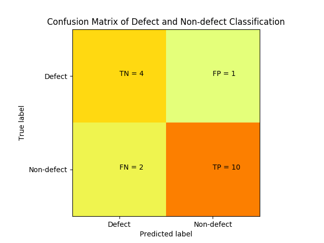

# CNN Gear Classification using Keras

### data

### model

dataSet for data (images) loading and labelling
main_cnn contains main models for training and testing

for tesing data (images) will be shown in result_test.csv

### output 

AUC score = 0.879

Accuracy score =  0.883
